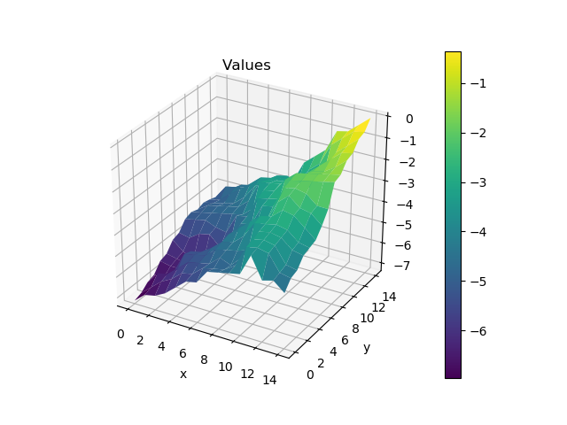
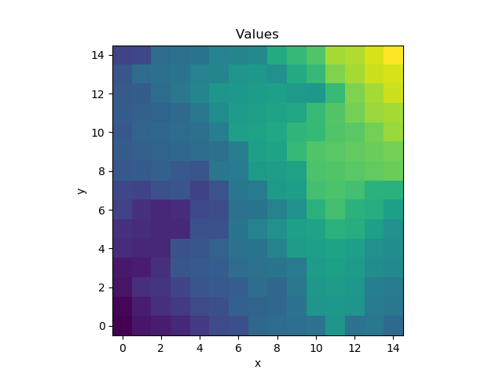
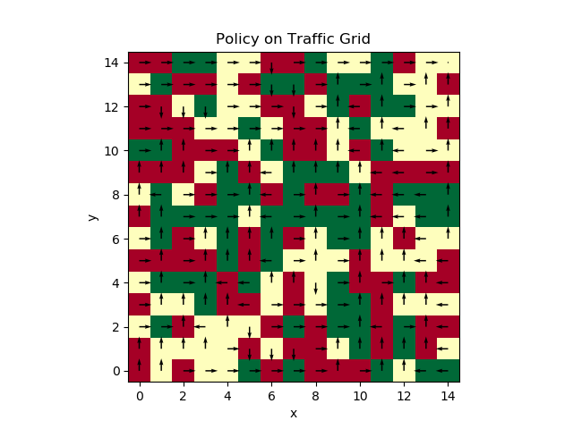

# Route Finding in Stochastic Traffic Model

We model a street grid as a graph. 

The edges represent streets. Each street has a random value representing how long it'll take to traverse it. 

The environment is a 2D grid, so that each node is connected to its neighbors. The goal is to get to the top right corner of the grid.

Nodes represent corners, where we can make a decision about which street to take next.

Each corner has a traffic value. This value represents how likely it is that the car will make it through the corner in any single attempt. 

The reward given by each corner is the negative of the wait time at each corner. This reward is incurred every time a car turns into a corner (i.e. the reward is given when we transition into the corner node).

Value Function at Each Corner (15x15 Grid)

Policy Overlaid on Traffic

